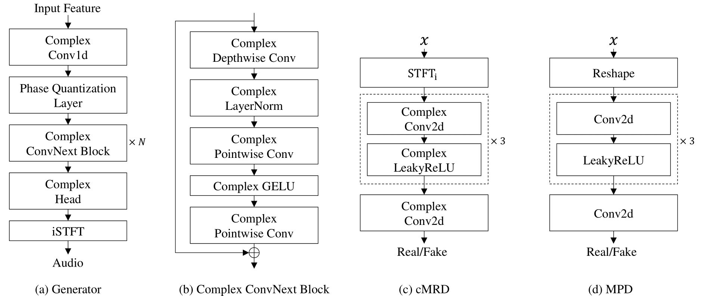

# Toward Complex-Valued Neural Networks for Waveform Generation (ICLR 2026)
#### Hyung-Seok Oh, Deok-Hyeon Cho, Seung-Bin Kim and Seong-Whan Lee 

This repository contains the official implementation of ComVo,
a complex-valued neural vocoder for waveform generation based on iSTFT.

[](https://openreview.net/forum?id=U4GXPqm3Va)
[](https://hs-oh-prml.github.io/ComVo/)

<p align="center">
  
  <br>
  <em>Overall architecture of ComVo</em>
</p>


## Abstract

Neural vocoders have recently advanced waveform generation, yielding natural and expressive audio.
Among these approaches, iSTFT-based vocoders have gained attention. 
They predict a complex-valued spectrogram and then synthesize the waveform via iSTFT, thereby avoiding redundant, computationally expensive upsampling. 
However, current approaches use real-valued networks that process the real and imaginary parts independently.
This separation limits their ability to capture the inherent structure of complex spectrograms.
We present ComVo, a Complex-valued neural Vocoder whose generator and discriminator use native complex arithmetic.
This enables an adversarial training framework that provides structured feedback directly in the complex domain.
To guide phase transformations in a structured manner, we introduce phase quantization, which discretizes phase values and regularizes the training process.
Finally, we propose a block-matrix computation scheme to improve training efficiency by reducing redundant operations. 
Experiments demonstrate that ComVo achieves higher synthesis quality than comparable real-valued baselines, and that its block-matrix scheme reduces training time by 25\%.
Audio samples and code are available at [https://hs-oh-prml.github.io/ComVo/](https://hs-oh-prml.github.io/ComVo/).


### Installation

```bash
pip install -r requirements
```
#### Recommended environment
- Python ≥ 3.8
- PyTorch ≥ 2.0
- CUDA-enabled GPU

## Train
```
python train.py -c configs/configs.yaml
```
Hyperparameters are specified in `configs/configs.yaml`.

## Inference 
```
python infer.py -c configs/configs.yaml --file_list=test.txt
```

## Citation

```bibtex
@inproceedings{
    anonymous2026toward,
    title={Toward Complex-Valued Neural Networks for Waveform Generation},
    author={Anonymous},
    booktitle={The Fourteenth International Conference on Learning Representations},
    year={2026},
    url={https://openreview.net/forum?id=U4GXPqm3Va}
}
```